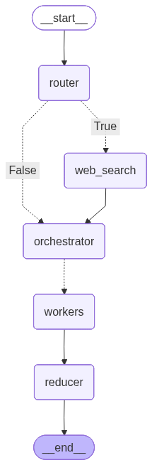

# AI Blog Generator 🤖✍️

An intelligent, multi-agent blog generation system powered by LangGraph that creates comprehensive, illustrated blog posts with automatic image generation and PDF export capabilities.

## ✨ Features

- **Multi-Agent Architecture**: Parallel processing using LangGraph's agent orchestration
- **Intelligent Planning**: Automatically structures blog content into 5-7 coherent sections
- **Smart Web Search**: Optional Tavily integration for researching current topics
- **Multi-LLM Support**: Leverages both Groq (Llama 3.3 70B) and HuggingFace models
- **AI Image Generation**: Automatic technical diagram and illustration creation using Stable Diffusion
- **Human-in-the-Loop**: Interactive decision-making for PDF generation
- **Export Options**: Markdown and PDF output formats
- **State Management**: Built-in checkpointing for resumable workflows

## 🏗️ Architecture

This project implements an **agentic AI workflow** with the following components:

### Parent Graph
1. **Router**: Determines if web search is needed
2. **Web Search**: Gathers additional information via Tavily (optional)
3. **Orchestrator**: Creates detailed blog outline
4. **Workers**: Parallel agents writing individual sections
5. **Reducer**: Aggregates results and invokes subgraph

### Subgraph
1. **Concat MD**: Merges all sections into complete markdown
2. **Placeholder Generator**: Identifies locations for images
3. **Image Generator**: Creates technical illustrations using Stable Diffusion
4. **Merge Image MD**: Embeds images into final document



## 🚀 Getting Started

### Prerequisites

- Python 3.9+
- Pandoc (for PDF generation)
- API Keys:
  - Groq API key
  - HuggingFace API token
  - Tavily API key (optional, for web search)

### Installation

1. **Clone the repository**
   ```bash
   git clone https://github.com/unixx0/ai-blog-generator.git
   cd ai-blog-generator
   ```

2. **Install dependencies**
   ```bash
   pip install -r requirements.txt
   ```

3. **Install Pandoc**
   - **Windows**: `choco install pandoc` or download from [pandoc.org](https://pandoc.org/installing.html)
   - **macOS**: `brew install pandoc`
   - **Linux**: `sudo apt-get install pandoc`

4. **Set up environment variables**
   
   Create a `.env` file in the project root:
   ```env
   groq2=your_groq_api_key
   test=your_huggingface_token
   tavily=your_tavily_api_key
   ```

### Usage

Run the blog generator:
```bash
python main.py
```

**Interactive Prompts:**
1. Enter your blog topic
2. The system will generate the blog automatically
3. Choose whether to export as PDF

**Example:**
```
Enter the topic for your blog generation: Self Attention Mechanism
```

Output files:
- `self_attention_mechanism.md` - Markdown file with embedded images
- `PDF's/self_attention_mechanism.pdf` - PDF export (optional)
- `images/` - Generated technical diagrams

## 📦 Project Structure

```
ai-blog-generator/
├── main.py                 # Main application entry point
├── logger.py              # Logging configuration
├── requirements.txt       # Python dependencies
├── .env                   # Environment variables (create this)
├── .gitignore            # Git ignore rules
├── images/               # Generated images directory
├── PDF's/                # Generated PDFs directory
├── parent_flowchart.png  # Architecture diagram
└── README.md             # This file
```

## 🛠️ Tech Stack

- **LangGraph**: Multi-agent workflow orchestration
- **LangChain**: LLM integration and tooling
- **Groq**: Fast LLM inference (Llama 3.3 70B)
- **HuggingFace**: Additional LLM and image generation
- **Tavily**: Web search API
- **Stable Diffusion XL**: Technical diagram generation
- **Pydantic**: Data validation and structured outputs
- **Pypandoc**: Document conversion (MD → PDF)

## 🤖 How It Works

1. **Topic Analysis**: Router agent determines if web research is needed
2. **Research** (Optional): Tavily searches for relevant information
3. **Planning**: Orchestrator creates a structured outline
4. **Parallel Writing**: Multiple worker agents write sections simultaneously
5. **Image Planning**: AI identifies where technical diagrams would help
6. **Image Generation**: Stable Diffusion creates relevant illustrations
7. **Assembly**: Final document is compiled with embedded images
8. **Export**: Saved as markdown, optionally converted to PDF

## 📊 Example Output

The system generates professional blog posts with:
- Clear section hierarchy
- Technical explanations with examples
- Relevant diagrams and flowcharts
- Proper markdown formatting
- Hyperlinked references (when web search is used)

## 🔧 Configuration

### LLM Models
- **Primary**: `llama-3.3-70b-versatile` (Groq)
- **Secondary**: `meta-llama/Llama-3.3-70B-Instruct` (HuggingFace)
- **Image Model**: `stabilityai/stable-diffusion-xl-base-1.0`

### Customization
Edit `main.py` to:
- Change LLM models
- Adjust section count (currently 5-7)
- Modify image generation settings
- Customize system prompts

## 🐛 Troubleshooting

**"KeyError: 'web_result'"**
- Ensure proper state initialization in orchestrator

**"tool_use_failed" from Groq**
- Check Pydantic model field definitions
- Verify all required fields have descriptions

**PDF generation fails**
- Install Pandoc: [pandoc.org/installing.html](https://pandoc.org/installing.html)
- Check MiKTeX is updated (Windows)

**Image generation slow**
- HuggingFace inference can take 30-60 seconds per image
- Consider using dedicated GPU instances


## 🤝 Contributing

Contributions are welcome! Please feel free to submit a Pull Request.

## 👤 Author

Yunish Udas

## 🙏 Acknowledgments

- Built with [LangGraph](https://github.com/langchain-ai/langgraph)
- Powered by [Groq](https://groq.com/) and [HuggingFace](https://huggingface.co/)
- Search by [Tavily](https://tavily.com/)
