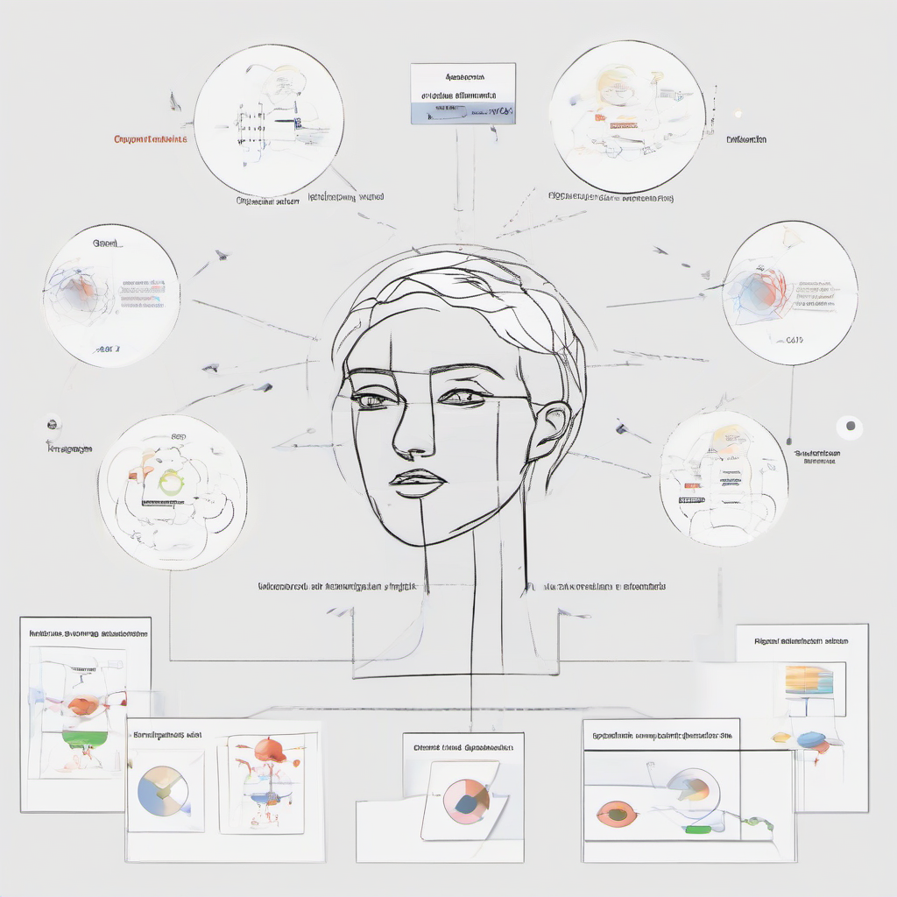

# Understanding Self Attention Mechanism
### Introduction to Self Attention
The Self Attention Mechanism is a fundamental component in deep learning models, particularly in the realm of Natural Language Processing (NLP) and Computer Vision. **Self Attention**, also known as intra-attention, is a mechanism that allows a model to attend to different positions of the input sequence simultaneously and weigh their importance. This is different from traditional attention mechanisms, which focus on attending to different parts of the input sequence sequentially.

The importance of Self Attention lies in its ability to:
* Handle long-range dependencies in input sequences
* Capture complex relationships between different parts of the input data
* Reduce the need for recurrent neural networks (RNNs) and convolutional neural networks (CNNs) in certain applications

Self Attention has numerous applications in:
* **Machine Translation**: Self Attention is used in sequence-to-sequence models to improve translation accuracy
* **Text Summarization**: Self Attention helps models to focus on the most important parts of the input text when generating summaries
* **Image Captioning**: Self Attention is used to attend to different regions of the input image when generating captions

For example, in a machine translation task, Self Attention can be used to attend to different words in the input sentence and weigh their importance when generating the translated sentence. This can help to improve the accuracy of the translation by capturing complex relationships between different words in the input sentence.


### Background and Motivation
The self-attention mechanism has its roots in traditional attention mechanisms, which were first introduced in the context of machine translation. In traditional attention mechanisms, the model focuses on different parts of the input sequence when generating each output element. However, these mechanisms have some limitations. For instance, they are often designed for specific tasks and require significant modifications to be applied to other tasks.

The self-attention mechanism, on the other hand, is a more general and flexible approach that allows the model to attend to all positions in the input sequence simultaneously and weigh their importance. This is particularly useful for tasks such as language modeling, text classification, and question answering, where the model needs to capture long-range dependencies and relationships between different parts of the input sequence.

The motivation behind the self-attention mechanism can be illustrated with an example. Consider a sentence like "The cat sat on the mat." In order to understand the meaning of this sentence, the model needs to capture the relationships between the words "cat" and "sat", as well as between the words "mat" and "on". Traditional attention mechanisms would focus on one word at a time, whereas the self-attention mechanism allows the model to consider all words in the sentence simultaneously and weigh their importance.

Some key benefits of the self-attention mechanism include:
* **Parallelization**: Self-attention can be parallelized more easily than traditional attention mechanisms, making it more efficient for large-scale tasks.
* **Flexibility**: Self-attention can be applied to a wide range of tasks, including language modeling, text classification, and question answering.
* **Improved performance**: Self-attention has been shown to improve performance on a variety of natural language processing tasks, particularly those that require capturing long-range dependencies.



### Mathematical Formulation
The self-attention mechanism is a core component of the Transformer architecture, introduced in the paper "Attention is All You Need" by Vaswani et al. The mathematical formulation of self-attention can be broken down into several key components:
#### Query, Key, and Value Vectors
The self-attention mechanism relies on three types of vectors:
* **Query vector (Q)**: represents the context in which the attention is being applied
* **Key vector (K)**: represents the information being attended to
* **Value vector (V)**: represents the information being retrieved based on the attention weights

These vectors are typically obtained by linearly transforming the input sequence, using learnable weights. For a sequence of input vectors `X = [x1, x2, ..., xn]`, the query, key, and value vectors can be computed as follows:
* `Q = X * W_Q`
* `K = X * W_K`
* `V = X * W_V`

where `W_Q`, `W_K`, and `W_V` are learnable weight matrices.

#### Attention Weights
The attention weights are computed by taking the dot product of the query and key vectors, and applying a softmax function:
* `Attention weights (A) = softmax(Q * K^T / sqrt(d))`

where `d` is the dimensionality of the input vectors, and `K^T` is the transpose of the key vector matrix.

#### Output Computation
The final output of the self-attention mechanism is computed by taking the dot product of the attention weights and the value vectors:
* `Output (Z) = A * V`

This output represents the weighted sum of the input vectors, based on the attention weights.

#### Example
To illustrate the self-attention mechanism, consider a simple example where we have a sequence of input vectors `X = [x1, x2, x3]`, and we want to compute the self-attention output for the first input vector `x1`. We can compute the query, key, and value vectors as follows:
* `Q = [x1, x2, x3] * W_Q = [q1, q2, q3]`
* `K = [x1, x2, x3] * W_K = [k1, k2, k3]`
* `V = [x1, x2, x3] * W_V = [v1, v2, v3]`

We can then compute the attention weights and output as follows:
* `A = softmax([q1, q2, q3] * [k1, k2, k3]^T / sqrt(d)) = [a1, a2, a3]`
* `Z = [a1, a2, a3] * [v1, v2, v3] = z1`

The final output `z1` represents the weighted sum of the input vectors, based on the attention weights. This output can be used as input to subsequent layers, or as the final output of the model.


### Types of Self Attention
The self-attention mechanism can be categorized into several types, each with its own strengths and weaknesses. The two most commonly used types are:
* **Scaled Dot-Product Attention**: This type of attention mechanism calculates the attention weights by taking the dot product of the query and key vectors, divided by the square root of the dimensionality of the vectors. The scaled dot-product attention is computationally efficient and is widely used in many state-of-the-art models.
* **Multi-Head Attention**: This type of attention mechanism extends the scaled dot-product attention by applying it multiple times in parallel, with different weight matrices. The outputs from each attention head are then concatenated and linearly transformed to produce the final output. Multi-head attention allows the model to capture different types of relationships between the input elements.

Example use cases for these types of self-attention mechanisms include:
* Using scaled dot-product attention for machine translation tasks, where the model needs to focus on specific parts of the input sequence to generate the output.
* Using multi-head attention for question answering tasks, where the model needs to capture different types of relationships between the input elements, such as semantic and syntactic relationships.

Other types of self-attention mechanisms include:
* **Hierarchical Attention**: This type of attention mechanism applies attention at multiple levels of granularity, such as word-level and sentence-level attention.
* **Local Attention**: This type of attention mechanism only considers a fixed-size window of input elements when calculating the attention weights.
* **Graph Attention**: This type of attention mechanism is used for graph-structured data, where the model needs to capture relationships between nodes in the graph.

### Applications of Self Attention
Self-attention mechanisms have numerous applications across various domains, including:
* **Natural Language Processing (NLP)**: Self-attention is a crucial component of transformer models, which have achieved state-of-the-art results in tasks such as machine translation, text classification, and question answering. For example, the BERT model uses self-attention to capture contextual relationships between words in a sentence.
* **Computer Vision**: Self-attention can be used to model relationships between different regions of an image, allowing for more accurate object detection, segmentation, and generation tasks. For instance, self-attention can be used to focus on specific parts of an image when generating captions.
* **Recommender Systems**: Self-attention can be used to model user preferences and item relationships, allowing for more personalized and accurate recommendations. For example, a self-attention based recommender system can learn to focus on specific user behaviors or item attributes when making recommendations.
* **Speech Recognition**: Self-attention can be used to model relationships between different audio segments, allowing for more accurate speech recognition and transcription.
* **Time Series Forecasting**: Self-attention can be used to model relationships between different time steps, allowing for more accurate forecasting and prediction of time series data. 

These applications demonstrate the versatility and effectiveness of self-attention mechanisms in modeling complex relationships and dependencies in various domains.

### Implementation and Optimization
The self-attention mechanism can be implemented using various techniques to improve its performance and efficiency. Here are some ways to implement and optimize self-attention mechanisms:
#### Parallelization
Self-attention mechanisms can be parallelized to take advantage of multiple CPU or GPU cores. This can be achieved by:
* **Splitting the input sequence**: Divide the input sequence into smaller chunks and process each chunk in parallel.
* **Using parallel attention**: Compute attention weights for each chunk in parallel and then combine the results.

#### Pruning Techniques
Pruning techniques can be used to reduce the computational cost of self-attention mechanisms. Some common pruning techniques include:
* **Attention head pruning**: Remove attention heads that are not contributing significantly to the model's performance.
* **Weight pruning**: Remove weights that are below a certain threshold to reduce the model's parameters.
* **Neuron pruning**: Remove neurons that are not contributing significantly to the model's performance.

#### Example Code
Here is an example code snippet in PyTorch that demonstrates how to implement self-attention mechanisms with parallelization:
```python
import torch
import torch.nn as nn
import torch.nn.parallel as parallel

class SelfAttention(nn.Module):
    def __init__(self, embed_dim, num_heads):
        super(SelfAttention, self).__init__()
        self.embed_dim = embed_dim
        self.num_heads = num_heads
        self.query_linear = nn.Linear(embed_dim, embed_dim)
        self.key_linear = nn.Linear(embed_dim, embed_dim)
        self.value_linear = nn.Linear(embed_dim, embed_dim)

    def forward(self, x):
        # Split the input sequence into chunks
        chunks = torch.split(x, 10, dim=1)

        # Process each chunk in parallel
        outputs = parallel.parallel_apply([self._forward_chunk] * len(chunks), chunks)

        # Combine the results
        output = torch.cat(outputs, dim=1)
        return output

    def _forward_chunk(self, chunk):
        # Compute attention weights
        query = self.query_linear(chunk)
        key = self.key_linear(chunk)
        value = self.value_linear(chunk)
        attention_weights = torch.matmul(query, key.T) / math.sqrt(self.embed_dim)

        # Compute output
        output = torch.matmul(attention_weights, value)
        return output
```
Note that this is a simplified example and may not be suitable for production use. In practice, you may need to consider additional factors such as padding, masking, and regularization.

### Conclusion and Future Directions
The self-attention mechanism has revolutionized the field of natural language processing and beyond, enabling models to capture complex relationships within input data. In this blog, we have explored the fundamentals of self-attention, its types, and applications. 

To summarize, the key takeaways are:
* Self-attention allows models to weigh the importance of different input elements relative to each other.
* It has been instrumental in achieving state-of-the-art results in various NLP tasks, such as machine translation, question answering, and text summarization.
* Different variants of self-attention, like local self-attention and hierarchical self-attention, have been proposed to improve efficiency and capture long-range dependencies.

Looking ahead, future research directions for self-attention mechanisms include:
* **Improving computational efficiency**: Developing methods to reduce the quadratic complexity of self-attention, making it more suitable for longer input sequences.
* **Multimodal applications**: Exploring the use of self-attention in multimodal tasks, such as visual question answering, image captioning, and video analysis.
* **Explainability and interpretability**: Investigating techniques to provide insights into the decision-making process of self-attention based models, enhancing their transparency and trustworthiness.
* **Integration with other attention mechanisms**: Combining self-attention with other attention types, like hierarchical attention or graph attention, to create more powerful and flexible models.

As researchers continue to push the boundaries of self-attention mechanisms, we can expect to see significant advancements in areas like computer vision, speech recognition, and reinforcement learning, ultimately leading to more sophisticated and human-like AI systems.
